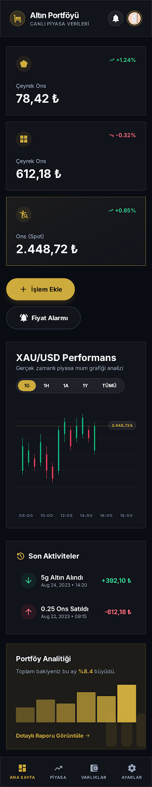
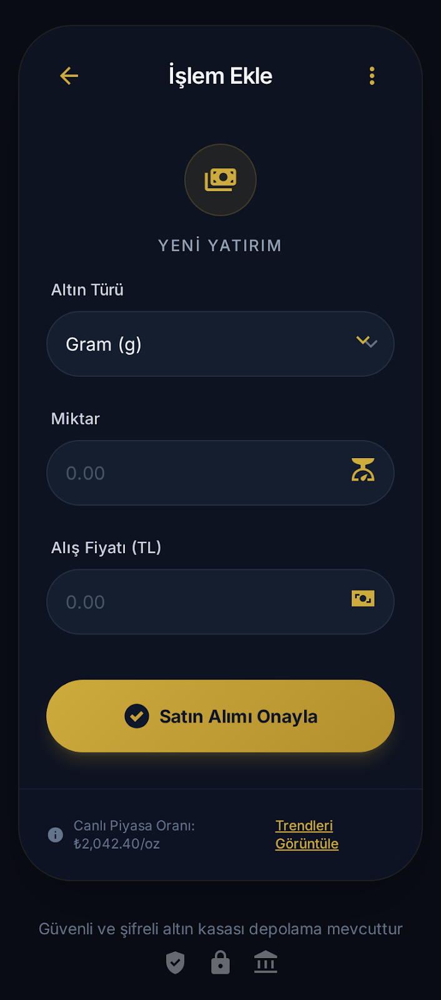
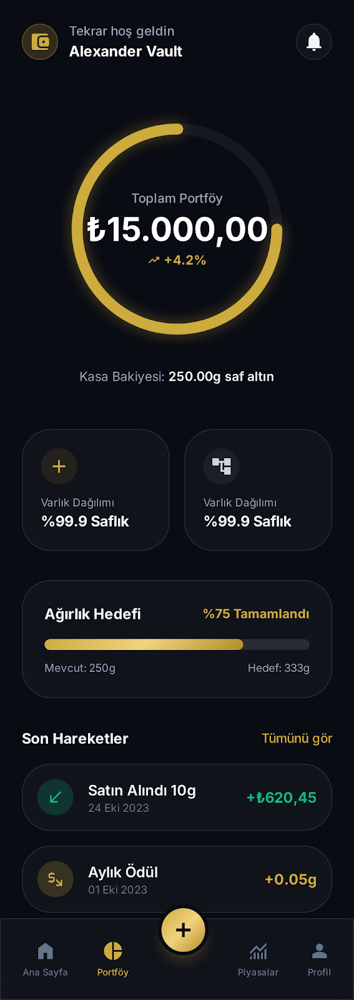
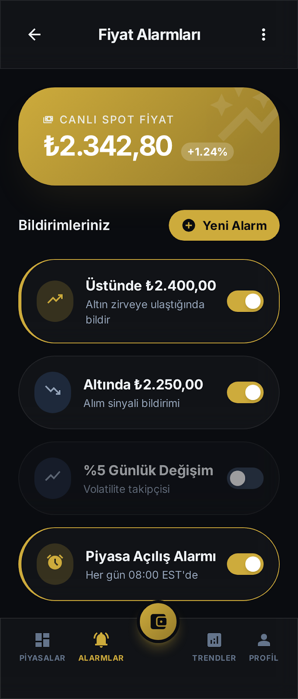

# Altın Nabız Uygulaması — Proje Dokümantasyonu

---

## Proje Adı

**Altın Nabız Uygulaması (Stitch Gold — Premium Altın Portföy Paneli)**

---

## Öğrenci Bilgileri

| Alan | Bilgi |
|---|---|
| Ad Soyad | Burakhan Yavuz |
| Öğrenci No | 24010509112 |

---

## Projenin Amacı ve Kısa Açıklaması

Bu proje, kullanıcıların altın portföylerini takip edebildiği, alım-satım işlemi ekelip yönetebildiği ve fiyat alarmları ayarlayabildiği bir **frontend web uygulamasıdır**.

Uygulama; sinematik bir fintech tasarım anlayışıyla hazırlanmış olup karanlık tema (dark mode), gerçek zamanlı görselleştirme bileşenleri ve yerel veri kalıcılığı (localStorage) içermektedir. Sayfalar arası gezinme için kalıcı bir alt navigasyon çubuğu bulunmaktadır. Proje ayrıca Playwright ile yazılmış otomatik uçtan uca (e2e) testler içermektedir.

---

## Kullanılan Teknolojiler / Kütüphaneler

| Teknoloji | Kullanım Amacı |
|---|---|
| HTML5 | Sayfa yapısı |
| CSS3 (özel değişkenler, glassmorphism) | Arayüz tasarımı |
| Tailwind CSS (CDN) | Yardımcı CSS sınıfları |
| JavaScript (Vanilla) | Form doğrulama, localStorage, etkileşim |
| Google Fonts — Inter | Tipografi |
| Google Material Symbols | İkon seti |
| Playwright (`@playwright/test ^1.42.0`) | Otomatik e2e test altyapısı |
| Node.js / npm | Bağımlılık yönetimi ve test çalıştırma |

---

## Proje Klasör Yapısı

```
stitch_universal_testing_engine/
│
├── index.html                  # Ana giriş sayfası — Altın Portföy Paneli
├── code.html_1.html            # Altın Takip Paneli sayfası
├── code.html_2.html            # İşlem Ekle sayfası
├── code.html_3.html            # Portföy Özeti sayfası
├── code.html_4.html            # Fiyat Alarmları sayfası
│
├── navigation.spec.ts          # Playwright e2e test dosyası
├── playwright.config.ts        # Playwright yapılandırması
├── package.json                # npm bağımlılıkları ve script tanımları
│
├── screen.png_1/
│   └── screen.png              # Ana panel ekran görüntüsü
├── screen.png_2/
│   └── screen.png              # İşlem Ekle ekran görüntüsü
├── screen.png_3/
│   └── screen.png              # Portföy Özeti ekran görüntüsü
├── screen.png_4/
│   └── screen.png              # Fiyat Alarmları ekran görüntüsü
│
└── readme.md                   # Proje genel açıklama dosyası
```

---

## Kurulum Adımları

1. Repoyu klonlayın:
   ```bash
   git clone https://github.com/Burakhan61/Alt-n-Nab-z-Uygulamas-
   cd Alt-n-Nab-z-Uygulamas-
   ```

2. Node.js bağımlılıklarını yükleyin:
   ```bash
   npm install
   ```

3. Playwright tarayıcılarını yükleyin:
   ```bash
   npx playwright install
   ```

---

## Çalıştırma / Kullanım Talimatları

### Uygulamayı Açmak

`index.html` dosyasını doğrudan tarayıcıda açın **veya** bir statik dosya sunucusu kullanın:

```bash
# Örnek: VS Code Live Server eklentisi ile açın
# Ya da Python ile:
python -m http.server 8080
# Ardından tarayıcıda: http://localhost:8080
```

### Sayfalar Arası Gezinme

Alt navigasyon çubuğundaki ikonlara tıklayarak sayfalar arasında geçiş yapabilirsiniz:

| Sayfa | Açıklama |
|---|---|
| Ana Sayfa | Portföy paneli ve 3D dalga simülasyonu |
| İşlem Ekle | Altın alım/satım formu (doğrulama + kaydetme) |
| Portföy | Portföy özeti ve grafik görünümü |
| Piyasalar | Fiyat alarmları (localStorage ile kalıcı) |
| Profil | Altın takip ve gösterge paneli |

### Testleri Çalıştırmak

```bash
# Tüm testleri çalıştır (headless)
npm test

# Tarayıcı görünür hâlde çalıştır
npm run test:headed

# İz (trace) kaydıyla çalıştır
npm run test:trace
```

**Test kapsamı:**
- Sayfalar arası navigasyonun doğru çalışması
- İşlem ekleme formunun doğrulama mesajlarını göstermesi
- Fiyat alarmı toggle'larının sayfa yenilemesinde kalıcı kalması

---

## Ekran Görüntüleri

### Ana Panel


### İşlem Ekle


### Portföy Özeti


### Fiyat Alarmları


---

## GitHub Proje Bağlantısı

[https://github.com/Burakhan61/Alt-n-Nab-z-Uygulamas-](https://github.com/Burakhan61/Alt-n-Nab-z-Uygulamas-)

---

## Kaynakça / Yararlanılan Bağlantılar

- [Playwright Resmi Dokümantasyonu](https://playwright.dev/docs/intro)
- [Tailwind CSS Dokümantasyonu](https://tailwindcss.com/docs)
- [Google Fonts — Inter](https://fonts.google.com/specimen/Inter)
- [Google Material Symbols](https://fonts.google.com/icons)
- [MDN Web Docs — localStorage](https://developer.mozilla.org/en-US/docs/Web/API/Window/localStorage)
- [MDN Web Docs — Form Validation](https://developer.mozilla.org/en-US/docs/Learn/Forms/Form_validation)
